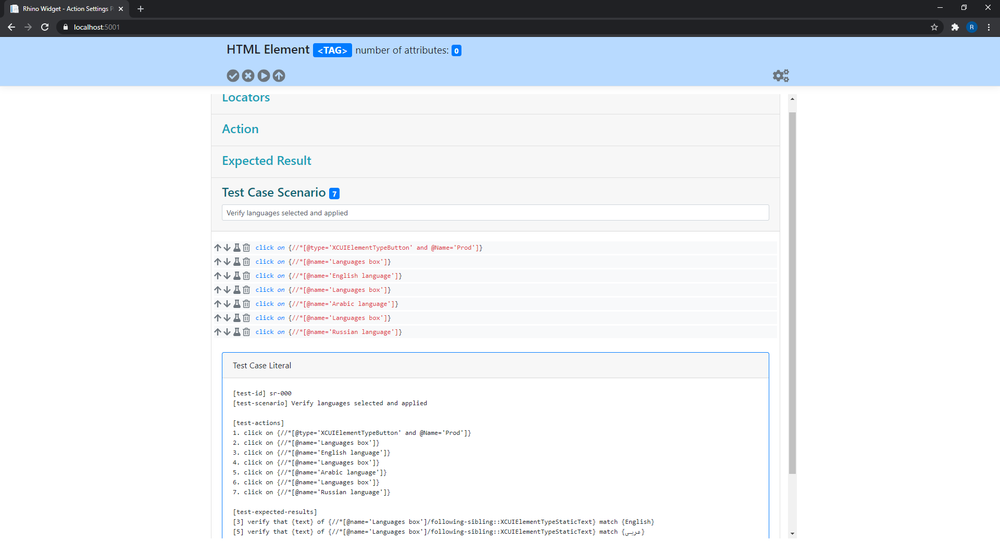

[Home](../Home.md 'Home')  

# Connect to Widget
10/19/2020 - 25 minutes to read

## In This Article
* [Supported Browsers](#supported-browsers)
* [Requirements](#requierments)
* [Google Chrome Installation](#google-chrome-installation)
* [MS Edge Chromium Installation](#ms-edge-chromium-installation)
* [Connect](#connect)
* [Disconnect](#disconnect)
* [Standalone Mode](#standalone-mode)

Rhino Widget is a **[Chrome Extension](https://developer.chrome.com/extensions) Exploratory Testing Tool** that works seamlessly integrated with Rhino actions repository and connectors.
It allows users to define exploratory testing scenarios, record and manipulate actions, set expected results, playback the recorded tests, automatically create tests using the different connectors and more.
It works integrated with Rhino Server Recorder, but can also be used in a standalone mode (directly from Rhino Server). 

> You can install Rhino Widget from the cloud.  
> [Google Store](https://chrome.google.com/webstore/detail/rhino-steps-recorder-and/giekjanbmlmabfagaddfkpcijefpgkdf)  
> [Edge Market Place](https://microsoftedge.microsoft.com/addons/detail/rhino-steps-recorder-and-/afmifehgcfflgnlhkfggdkmdlfmhpjag)  

## Supported Browsers
1. [Google Chrome](https://www.google.com/chrome/) - Latest
2. [MS Edge Chromium](https://www.microsoft.com/en-us/edge) - Latest

## Requirements
1. Either [Google Chrome](https://www.google.com/chrome/) or [MS Edge Chromium](https://www.microsoft.com/en-us/edge) installed.  

## Google Chrome Installation
1. Download the latest [Rhino Widget Release](https://github.com/savanna-projects/rhino-widget/releases) ZIP file.
2. Extract the file and place the extracted folder under the location you want to hold Rhino Widget (i.e. C:\Rhino\Widget).
3. Open Chrome Browser.
4. Type ```chrome://extensions/``` in the address bar, this will take you to the **Extensions** page.
5. Switch on **Developer mode**, on the top right corner of the screen

  
_image - Extensions Screen, Developer Mode_  
  
6. Click on ```Load unpacked``` button.

  
_image - Extensions Screen, Load Unpacked_  
  
7. Select the folder you have extracted in step NO.2 (make sure ```manifest.json``` file exists in that folder).  

  
_image - Extensions Screen, Select Folder_  

8. Click on ```Select Folder``` button.

  
_image - Extensions Screen, Extension Loaded_

## MS Edge Chromium Installation
1. Download the latest [Rhino Widget Release](https://github.com/savanna-projects/rhino-widget/releases) ZIP file.
2. Extract the file and place the extracted folder under the location you want to hold Rhino Widget (i.e. C:\Rhino\Widget).
3. Open Edge Browser.
4. Type ```edge://extensions/``` in the address bar, this will take you to the **Extensions** page.
5. Switch on **Developer mode**, on the bottom left corner of the screen

  
_image - Extensions Screen, Developer Mode_  
  
6. Click on ```Load unpacked``` button.

  
_image - Extensions Screen, Load Unpacked_  
  
7. Select the folder you have extracted in step NO.2 (make sure ```manifest.json``` file exists in that folder).  

  
_image - Extensions Screen, Select Folder_  

8. Click on ```Select Folder``` button.

  
_image - Extensions Screen, Extension Loaded_

## Connect
1. Navigate into the folder in which you have extracted Rhino Agent **[see Deployment](./Deployment.md)** for more information.
2. Run the following command:
```
dotnet Rhino.Agent.dll
```  

The following output is expected:
```
Now listening on: https://localhost:5001
Now listening on: http://localhost:5000
Application started. Press Ctrl+C to shut down.
```  

3. Open Chrome or Edge.
4. Open Rhino Widget Extension.
5. Check ```Connect to Local Server``` check box.
6. Click on ```Connect Recorder``` button.

  
_image - Rhino Widget Main Screen_  

The following behavior is expected:
1. Rhino Widget is now open in a different browser window.
2. Moving the mouse around the web site will cause elements to glow.  

  
_image - Rhino Widget Connected_  

## Disconnect
> Disconnect the widget will not delete you current work and you can allows connect again and continue from where you have left.  

Rhino Widget is persistent which means it will work on any browser you will open once you have connected. To close it (disconnect), please follow these steps:
1. Open Rhino Widget Chrome Extension.
2. Click on ```Disconnect``` button.  

  
_image - Rhino Widget Main Screen_  

## Standalone Mode
1. Navigate into the folder in which you have extracted Rhino Agent **[see Deployment](./Deployment.md)** for more information.
2. Run the following command:
```
dotnet Rhino.Agent.dll
```  

The following output is expected:
```
Now listening on: https://localhost:5001
Now listening on: http://localhost:5000
Application started. Press Ctrl+C to shut down.
```  

3. Open any modern browser.
4. Type ```https://localhost:5001``` in the address bar.  

  
_image - Rhino Widget Standalone_  

## Next Steps
* [Widget Overview - User Interface and Different Sections](./GettingStarted/WidgetOverview.md 'WidgetOverview')
* [Create Your First Automation](./GettingStarted/CreateYourFirstAutomation.md 'CreateYourFirstAutomation')

## See Also
* [Rhino Server Deployment](./Deployment.md)
* [Rhino Atlassian Connectors](https://github.com/savanna-projects/rhino-connectors-atlassian)
* [Rhino Plain Text Connector](https://github.com/savanna-projects/rhino-connectors-text)