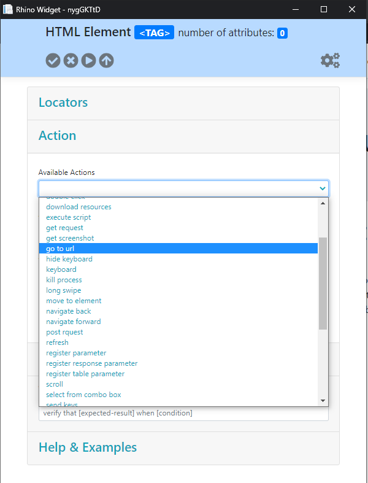
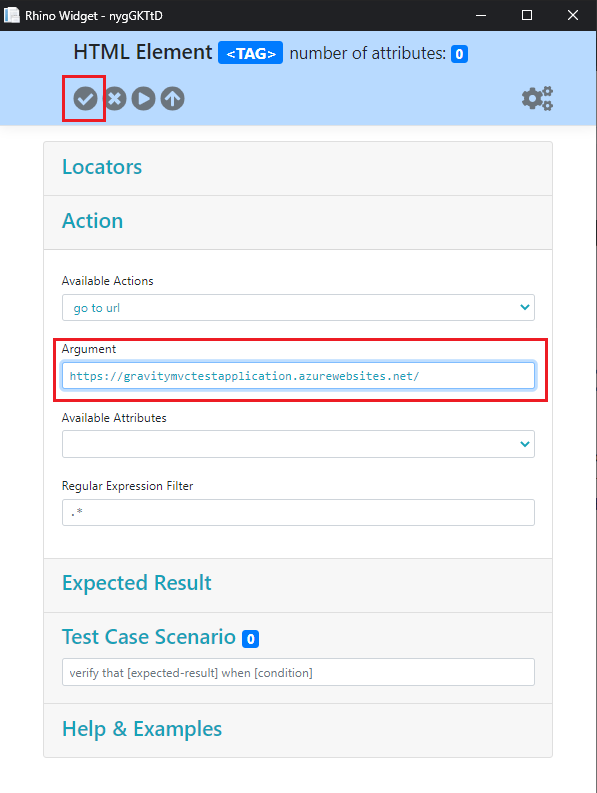
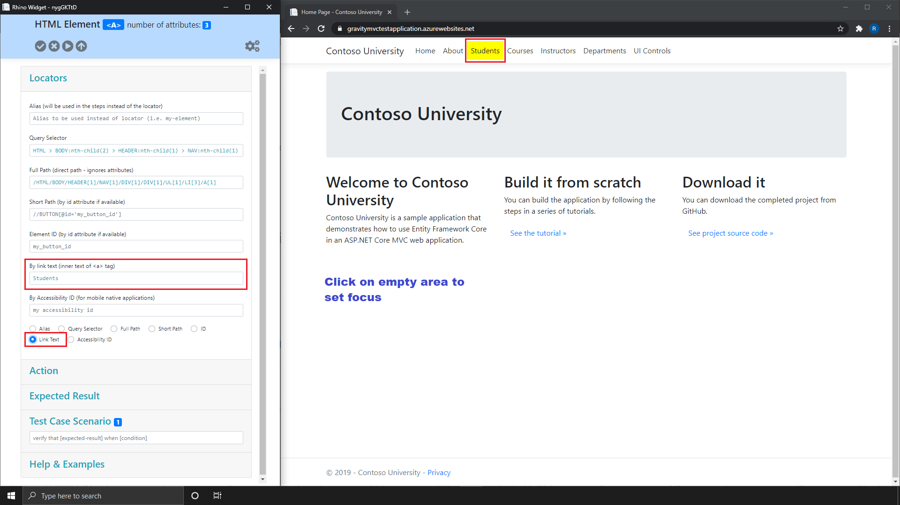
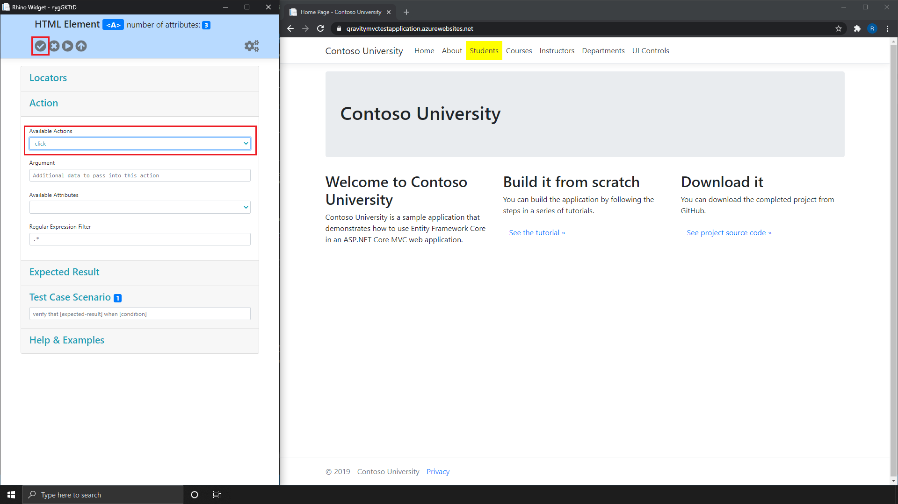
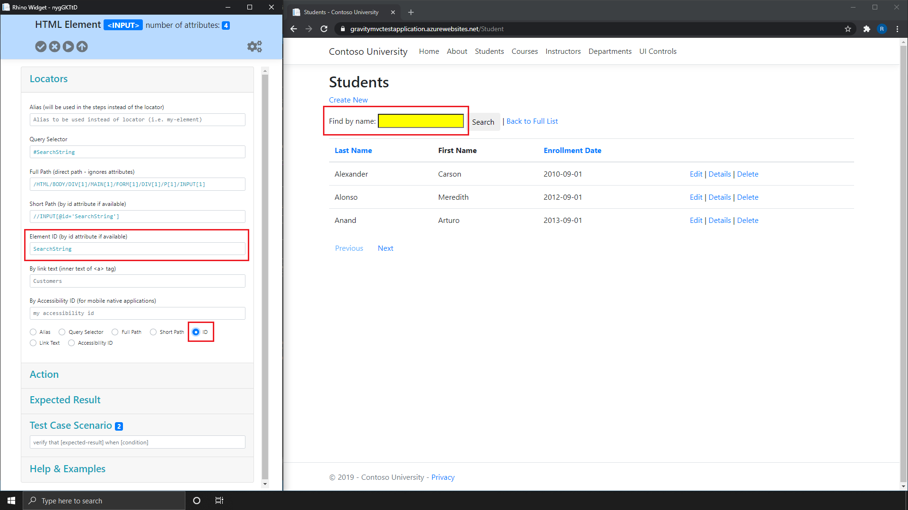
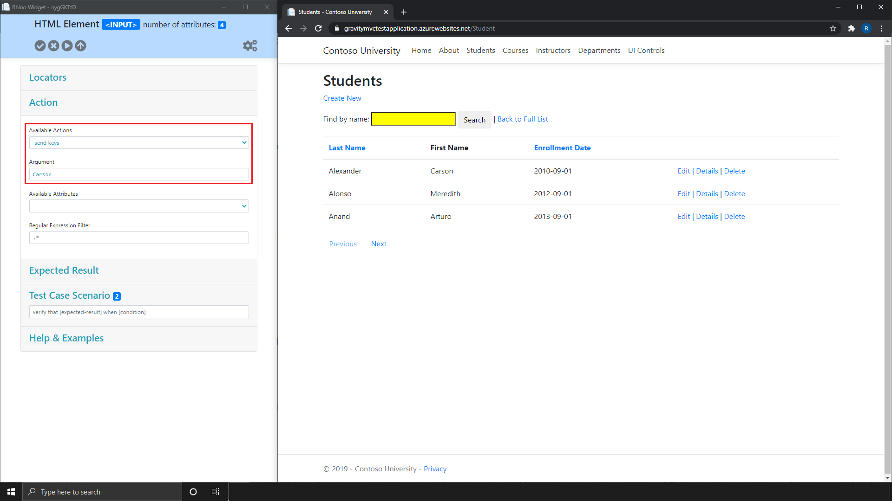
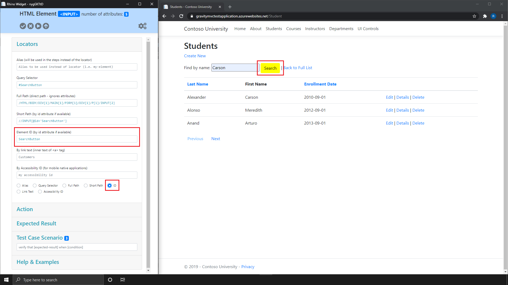
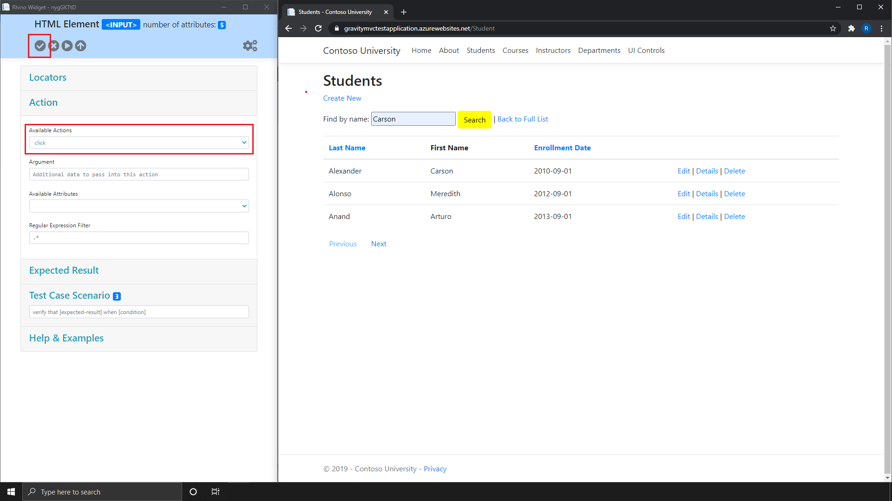
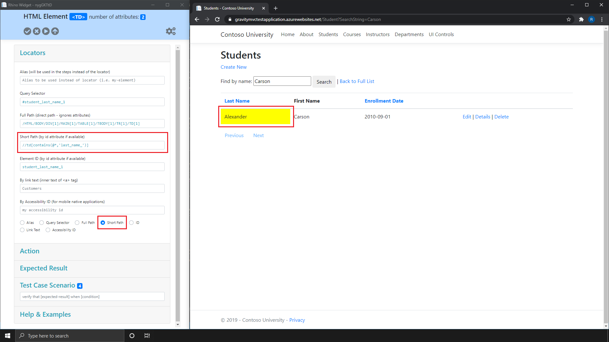
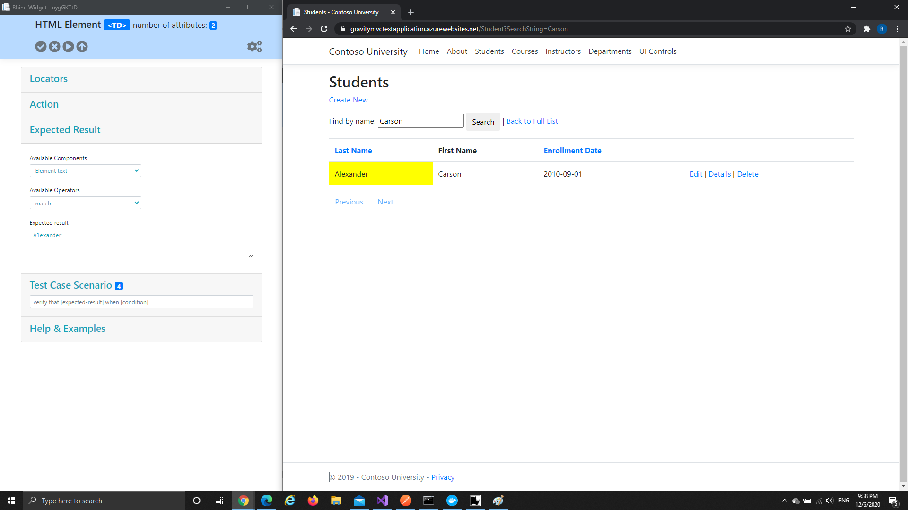

[Home](../Home.md 'Home')  

# Create your First Automation
12/05/2020 - 45 minutes to read

## In This Article
* [Prerequisites](#prerequisites)
* [Your First Action](#requirements)
* [Capture Elements and Save Actions](#configure-ssl-certificate)
* [Playback your Automation](#run-as-process)

> Warning!
>
> Rhino Agent needs a secure connection for recording actions over HTTPS. Please trust the certificate in order to be able to record your actions.  

## Prerequisites
1. Rhino Agent is up and running. Please refer to the different deployment methods for more information of how to deploy Rhino Agent.
2. Navigate to the web site https://gravitymvctestapplication.azurewebsites.net/.
3. Rhino Agent is connected. Please read [Connect to Widget](./ConnectWidget.md 'ConnectWidget') article for more information of how to connect Agent and Widget.
4. Download and extract Chrome Driver into _**C:\WebDrivers**_. Please refer to https://chromedriver.chromium.org/downloads for more information about driver download.

## Your First Action
Assuming your test is a _**Web Application**_ test the first action must be _**go to url**_. Please to the following action to add _**go to url**_ action:  

1. Under _Actions_ panel, select _**go to url**_ from _Available Actions_ combo box.  

  
_image - Action Panel_  
  
2. Under _Actions_ panel, type https://gravitymvctestapplication.azurewebsites.net/ into _Argument_ text box.
3. Click on _Save_ button in the top left corner of the Widget.  

  
_image - Action Panel_

## Capture Elements and Save Actions
Rhino favor capturing elements and select the desired action and properties over an automatic recording which in most cases needs to be cleaned up or capture "garbage" actions. In order to capture and element please do the following actions:  

1. Click on any empty area, to set focus on the application under test.
2. Hover with the mouse over _**Students**_ link, under the top navigation bar.
3. Press F7 to capture the element.  

> Warning!
>
> If at this point an alert will pop and ask you to approve or deny, please select approve and repeat steps 1-3.  

4. On the widget side, expand _Locators_ panel.
5. Check _**Link Text**_ radio button.  

  
_image - Locators Panel_  
  
5. On the widget side, expand _Actions_ panel.
6. Under _Actions_ panel, select _**click**_ from _Available Actions_ combo box.
7. Click on _Save_ button in the top left corner of the Widget.  

  
_image - Actions Panel_  
  
8. Click on _**Students**_ link, under the top navigation bar.
9. Hover with the mouse over _**Find by name**_ text box.
10. Press F7 to capture the element (Click on any empty area to set focus if you cannot capture).
11. On the widget side, expand _Locators_ panel.
12. Check _**ID**_ radio button.  

  
_image - Locators Panel_  
  
13. On the widget side, expand _Actions_ panel.
14. Under _Actions_ panel, select _**send keys**_ from _Available Actions_ combo box.
15. Under _Actions_ panel, type _**Carson**_ into _Argument_ text box.
16. Click on _Save_ button in the top left corner of the Widget.
17. On the application side, manually type _**Carson**_ into _**Find by name**_ text box.  
  
  
_image - Actions Panel_  
  
18. Press F7 to release the captured element (Click on any empty area to set focus if you cannot capture).
19. Hover with the mouse over _**Search**_ button.
20. Press F7 to capture the element (Click on any empty area to set focus if you cannot capture).
21. On the widget side, expand _Locators_ panel.
22. Check _**ID**_ radio button.  
  
  
_image - Locators Panel_  
  
23. On the widget side, expand _Actions_ panel.
24. Under _Actions_ panel, select _**Click**_ from _Available Actions_ combo box.
25. Click on _Save_ button in the top left corner of the Widget.
26. On the application side, manually click on _**Search**_ button.  
  
  
_image - Actions Panel_  
  
27. Hover with the mouse over _**Last Name**_ table cell.
28. Press F7 to capture the element (Click on any empty area to set focus if you cannot capture).
29. On the widget side, expand _Locators_ panel.
30. Check _**Short Path**_ radio button.
31. Set the value under _Short Path_ text box to ```//td[contains(@*,'last_name_')]```.  
  
  
_image - Locators Panel_ 

23. On the widget side, expand _Expected Result_ panel.
24. Under _Expected Result_ panel, select _**Element text**_ from _Available Components_ combo box.
25. Under _Expected Result_ panel, select _**Match**_ from _Available Operators_ combo box.
26. Under _Expected Result_ panel, type _**Alexander**_ into _Expected Result_ text area.
27. Click on _Save_ button in the top left corner of the Widget.  

  
_image - Expected Result Panel_  
  
28. On the widget side, expand _Actions_ panel.
29. Under _Actions_ panel, select _**close browser**_ from _Available Actions_ combo box.
30. Click on _Save_ button in the top left corner of the Widget.

## Playback your Automation

## See Also
* [Rhino Agent Deployment - Process Host](./Deployment.md 'Deployment')
* [Rhino Agent Deployment - Docker](./DeploymentDocker.md 'DeploymentDocker')
* [Rhino Agent Deployment - On IIS (Internet Information Service)](./DeploymentIIS.md 'DeploymentIIS')