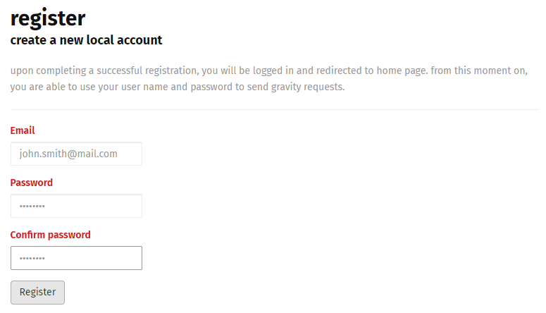

# Register
In order to execute your plugins using Gravity API, you need to create an account which identifies you. You need to provide an email and setting your password, which later will be used when you send Gravity requests.

> Gravity user is email formatted. That means you do not need to provide a real email (no email verification), as long as the user name you choose is a standard email phrase.

1. Navigate to Gravity API [Registration Page](https://g-api.azurewebsites.net/Identity/Account/Register)
2. Fill in the email you wish to register with
3. Set your password
4. Validate your password
5. Click on "Register" button

