[Home](../Home.md 'Home')  

# Verify Rhino Deployment
05/12/2020 - 25 minutes to read

## In This Article
* [Supported OS](#supported-os)
* [Requirements](#requirements)
* [Import Rhino API Documentation and Validation Tests](#import-rhino-api-documentation-and-validation-tests)

> This is an optional process and can be skipped if you already know that Rhino is correctly deployed.
> Some of the tests requires a connection to the outside world. If you are running in an isolated environment without connection, these tests will fail but if all other tests have passed, you can ignore these failed tests.

## Supported OS
> Rhino API runs on the latest .NET Core version.  

Please read [here](https://dotnet.microsoft.com/platform/support/policy) for OS support matrix.

## Requirements
1. Rhino Server up and running. Please explore the different deployment sections for more information of how to deploy Rhino Server.
3. Postman installed (latest version), read [here](https://www.postman.com/downloads/) for more information about how to download and install.

## Import Rhino API Documentation and Validation Tests
Rhino API use Postman for documentation and verification tests. Each  version comes with own documentation and tests and it is a very valuable resource.  

1. Open Postman application
2. Click on ```Import``` button  

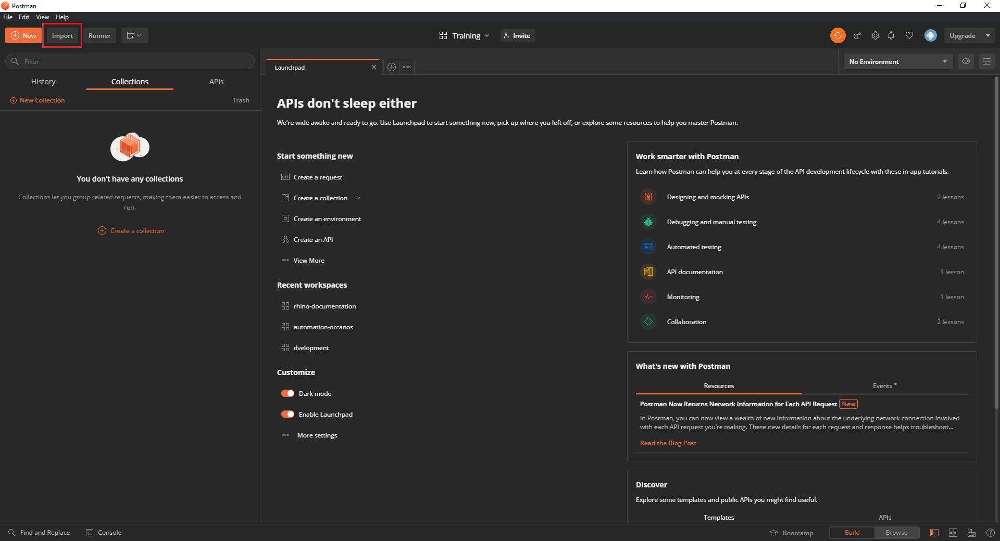  

3. Under ```IMPORT``` dialog, click on ```Upload File``` button  

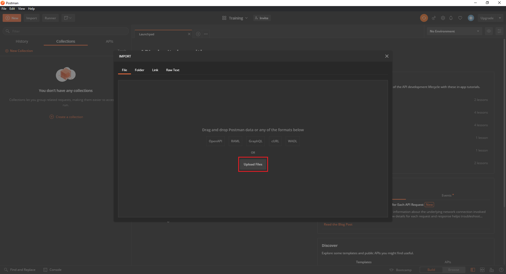 

4. Select the folder under which you [deployed Rhino](./Deployment.md)
5. Find the folder ```api-documentation``` and open it
6. Find the file ```Rhino API Reference Guide v3.postman_collection.json``` and double click on it or select it and click on ```Open``` button  

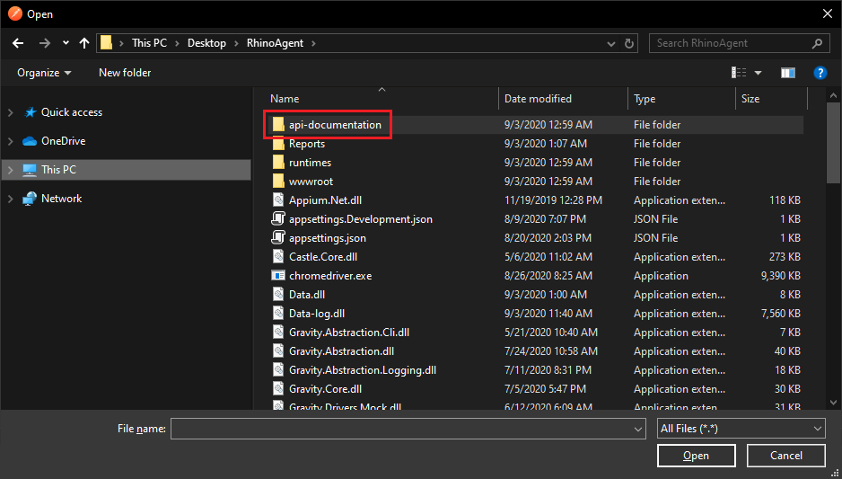  
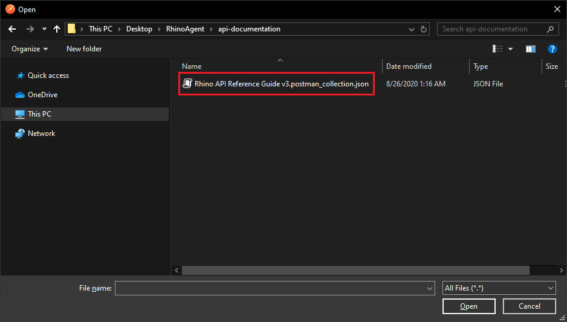  

7. Click on ```import``` button  

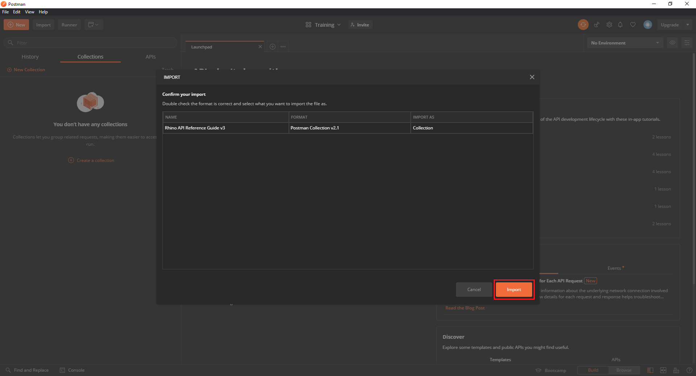  
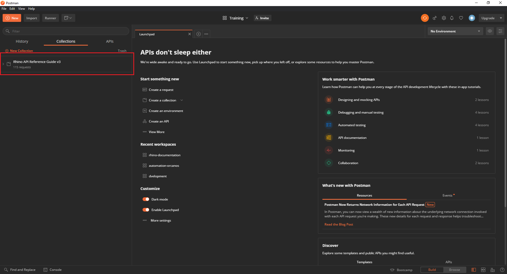  

8. Hover with the mouse cursor over the collection you have just created and click on the ```More Actions``` button.  

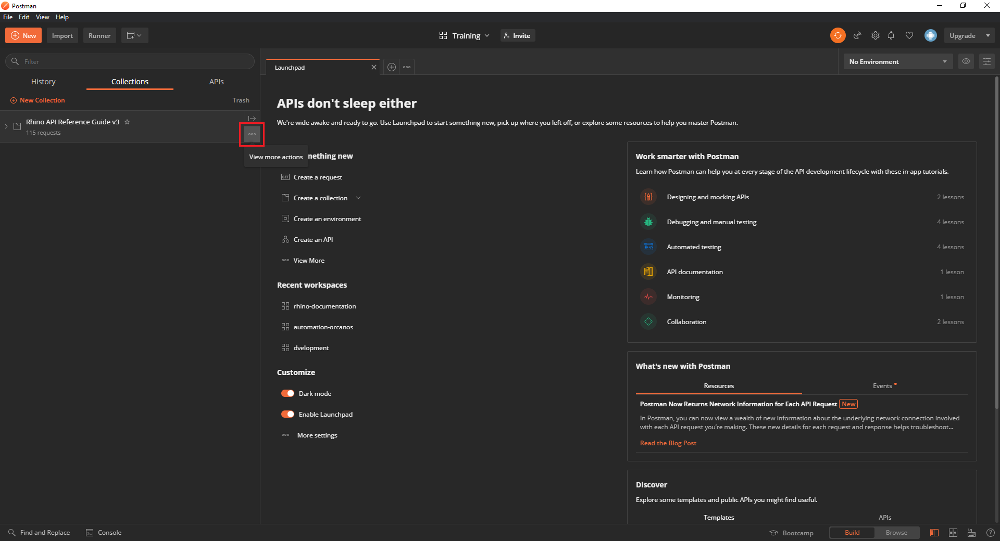  

9. click on ```Edit``` option  

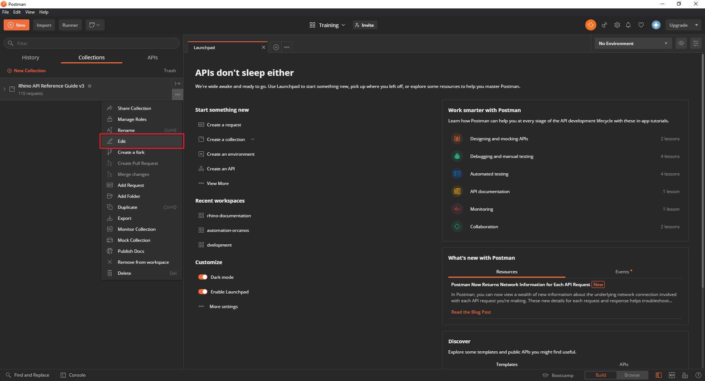  

10. click on ```Variables``` tab  

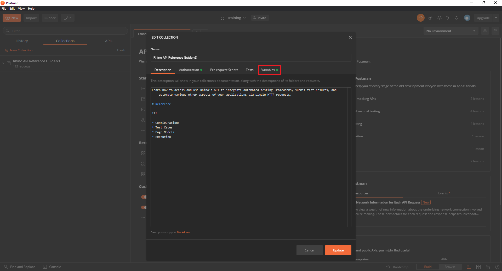  

11. Set the user and password [you have registered with](./Register) under the user and password parameters  

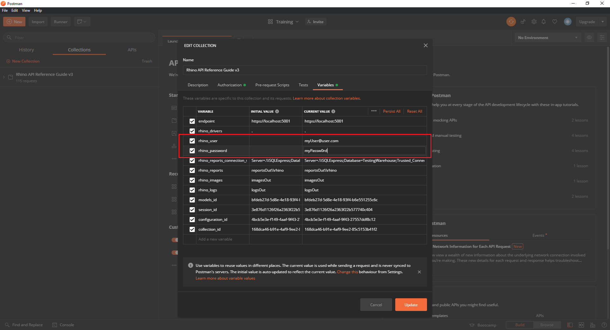  

12. Hover with the mouse cursor over the collection you have just created and click on the ```Expand``` arrow.  

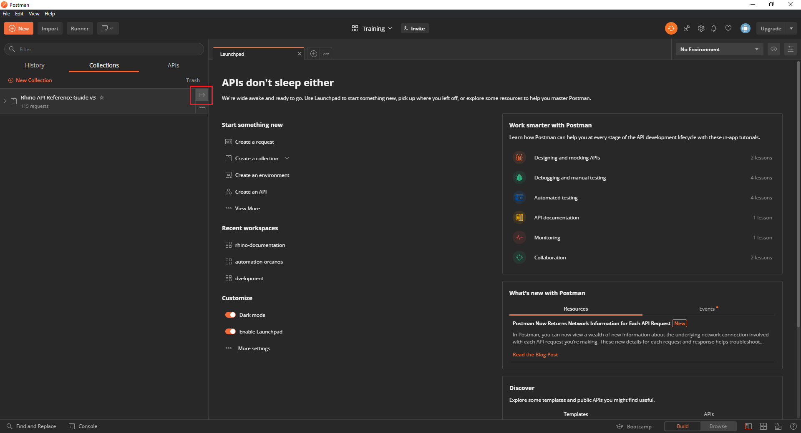  

13. Click on ```Run``` button - the ```Collection Runner``` window will open.  

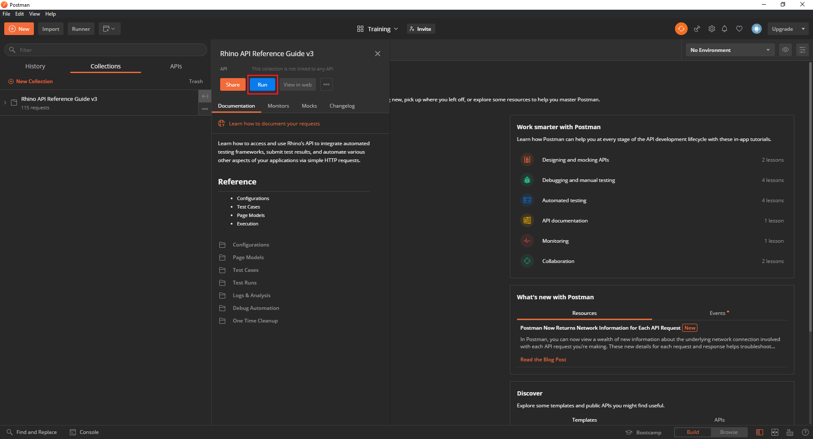  

14. Check the ```Save Responses``` check box  

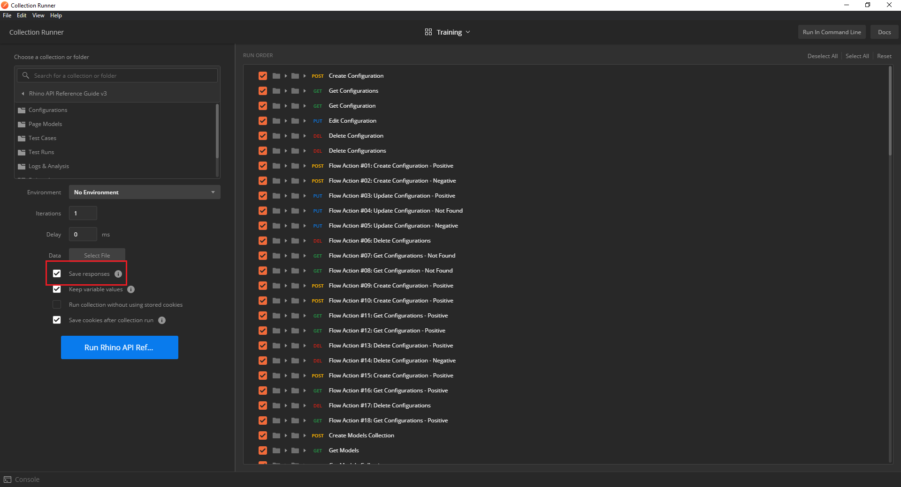  

15. Click on ```Run ...``` button  

  

At this point, a set of tests will run against Rhino API. If some tests will fail, checking the response under the failed test will explain why and
suggest how to fix the problem (if any).  