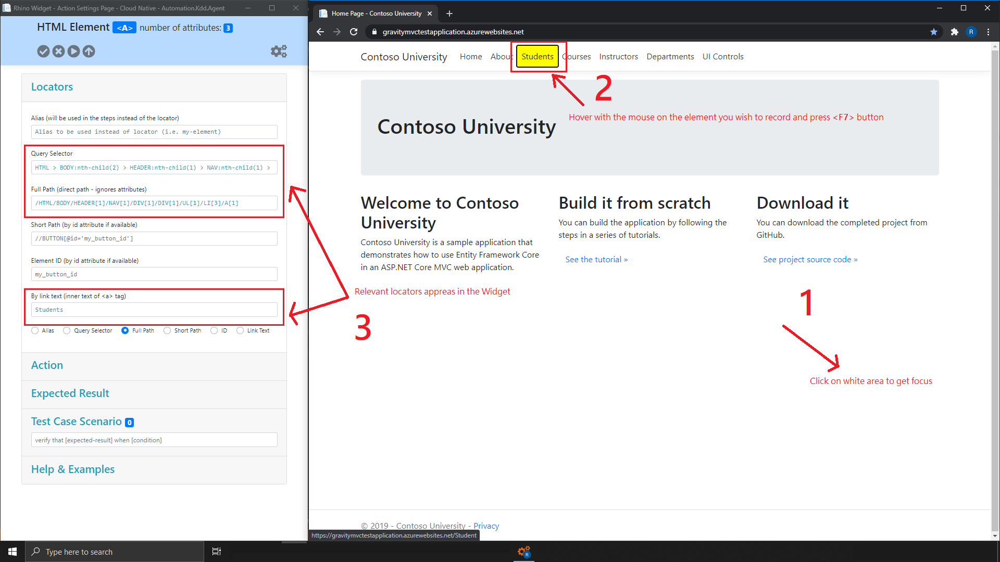
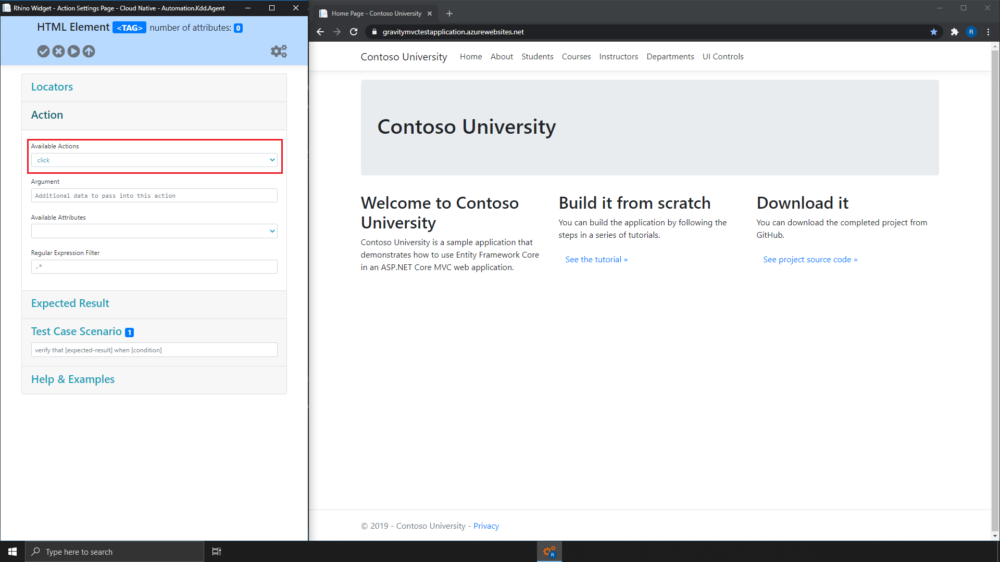
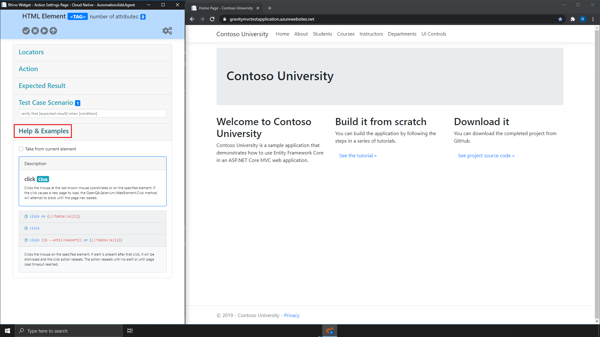

# Rhino Widget - Overview
* [Overview](#overview)
* [Locators](#locators)
* [Record Locators](#record-locators)
* [Actions](#actions)
* [Expected Results](#expected-results)
* [Scenario Interface](#scenario-interface)
* [Action Buttons](#action-buttons)
* [Setting Interface](#settings-interface)

## Overview
Rhino Widget helps you to build Rhino Spec using a simple exploratory testing and documentation your actions out of the available actions in
Rhino's repository.  

You can copy the spec once generated, edit it, send it directly to your A.L.M (i.e. Jira, Azure DevOps, etc.), or save it for later. The
widget is composed of few sections, each relevant for a different spec section.

> Please [read here](https://github.com/savanna-projects/rhino-agent/blob/master/docs/pages/ApiReference/TestCases.md) for deeper explanation about the different spec sections.

## Locators
Rhino recorder is being activated by connecting to Rhino widget. Once you are connected, Rhino widget
recorder is being activated as a yellow marker on your native browser.  Each element marked in yellow
records the element locators as follow:

1. [Query Selector (CSS)](#query-selector)
2. [Link Text](#link-text)
3. [ID](#id)
4. [Short XPath/Full XPath](#xpath)

### Query Selector
A [DOMString](https://developer.mozilla.org/en-US/docs/Web/API/DOMString) containing one or more selectors to match against.
This string must be a valid [CSS selector](https://developer.mozilla.org/en-US/docs/Web/CSS/CSS_Selectors) string.  

##### See Also
[CSS Selectors Tutorial](https://www.w3schools.com/css/css_syntax.asp)  
[CSS Selectors Reference](https://www.w3schools.com/cssref/css_selectors.asp)

### Link Text
A Link Text is used to identify the links element on a web page, by the inner text of ```<a></a>``` tags.  


```html
<a>Students</a>
<a>Home</a>
```  

To get the ```Students``` link, the value for the link text locator will be ```Students```.

### ID
ID is used to identify the element on a web page, by the value of ```id``` attribute.


```html
<a id="sdnt">Students</a>
<a id="home">Home</a>
```  

To get the ```Students``` link, the value for the ID locator will be ```sdnt```.

### XPath
A [XPath](https://developer.mozilla.org/en-US/docs/Web/XPath) containing one or more selectors to match against.
This string must be a valid XPath string.  

##### See Also
[XPath Tutorial](https://www.w3schools.com/xml/xpath_intro.asp)  
[XPath Reference](https://www.w3schools.com/xml/xpath_syntax.asp)

## Record Locators
In order to record a locator according to your test step do the following.
1. Focus on your web site (by click on any white area).
2. Move the mouse over the element you wish to record.
3. Press ```<F7>```.  

The following is expected
1. The yellow glow will freeze on the selected element.
2. The recorded locators appears in the Locators panel in the Widget.  

> Please note, some elements might not have all locator types, but all elements have ```CSS Selector``` and ```Full XPath``` locators.



## Actions
By using Rhino recorder, you can create simple or complex actions, each action can be recorded or manually created. Every action is
composed of 4 properties (the relevant properties for an action will be different, depends on the actions).

1. [Action](#action)
2. [Argument](#argument)
3. [Attribute](#attribute)
4. [Regular Expression](#regular-expression)

### Action
Action will use the locator in order to locate an element and perform the selected action on it. For example if I want to perform a click on 
a link with the ```Link Text``` students, I will select the ```Link Text``` locator and the ```Click``` action.


### Argument
Additional information to pass with the action. For example, if my action is ```GoToUrl``` the argument will be the URL I want to
navigate to (like ```https://www.foo.io```).  

> Please note, argument may be different, based on the action the information you want to pass.

### Attribute
The element attribute on which you want to perform you action. For example I want to navigate to a URL taken from element ```href``` attribute.
In that case, my action will be ```GoToUrl```, my locator will be the element I want to take the ```href``` attribute from and the attribute value
will be ```href```.  

> Please note, attributes are automatically populated when you record an element.

### Regual Expression
An extra filter to apply on text or attribute **before** action is performed.
For example I want to navigate to a URL taken from element ```text``` but the text contains more than just URL.
In that case, my action will be ```GoToUrl```, my locator will be the element I want to take the URL from and the
regular expression will be ```(www|http:|https:)+[^\s]+[\w]```.

##### See Also
[Regual Expression Reference](https://docs.microsoft.com/en-us/dotnet/standard/base-types/regular-expression-language-quick-reference)  

In order to get help and information about a specific action, select it from the list and expand the ```Help & Examples``` panel

  


## Expected Results
By using Rhino recorder, you can create simple or complex expected result, each result is manually created. Every expected result is
composed of 3 properties (the relevant properties for a result will be different, depends on the result type).  

> Please note, the expected results follow the same rules as [action](#actions) does (with locator and attributes).

1. [Component](#component)
2. [Operator](#operator)
3. [Expected Value](#expected-value)

### Component
The element component on which to perform assertion. For example, element text, element attribute, visibility status, etc.
This will be the actual result

### Operator
The operator to use when asserting the element component value (actual result) against the expected result value. For example,
equal, not equal, greater than, match (regular expression), etc.  

> Please note, not all operators are valid on certain situations, for example, using ```greater than``` with text values.

### Expected Value
The expected result value to assert against. This value may be different depends on the component selected.  

  
  

The expected result will be applied to the last action in the scenario and can seen when clicking on the beaker icon.  


## Scenario Interface
This is the place where you can see the recorded steps and their values, copy the generated spec, give a title to your test case and organize your test steps.

## Action Buttons
  
  
From Left to Right
|Button  |Description                                                        |
|--------|-------------------------------------------------------------------|
|Save    |Add test action or expected result to the current test scenario.   |
|Clear   |Clear all test actions. This cannot be undone.                     |
|Playback|Playback test scenario against Selenium Grid or driver.            |
|Export  |Save test scenario under application life cycle management (A.L.M).|
|Settings|Navigate to ```Settings``` page.                                   |

## Setting Interface
1. [Connector](#connector)
2. [Playback Options](#playback_options)
3. [Rhino Options](#rhino_options)

### Connector
|Field         |Description                                                                                                                           |
|--------------|--------------------------------------------------------------------------------------------------------------------------------------|
|Connector Type|Will be used to connect to an Application Lifecycle Manager (A.L.M). For example, Jira, Test Rail or Azure DevOps.                    |
|Server Address|The A.L.M server address as provided by the A.L.M provider. For example, http://myjira:8080/ or https://organization.visualstudio.com/|
|Project       |The project ID or Name under which to generate test cases. For example "My Project" or "PRJ-1".                                       |
|Test Suite    |Test suite or Test set id under which to create this test case. If not provided the test case will be created under the project.      |
|User Name     |A valid user with permissions to create test cases.                                                                                   |
|Password      |A valid password. Please note that on some A.L.M configurations you need to provide API Key or Token.                                 |

### Playback Options
|Field        |Description                                                                                                         |
|-------------|--------------------------------------------------------------------------------------------------------------------|
|Browser      |The browser on which to execute the test case playback.                                                             |
|Grid Endpoint|Grid endpoint or local driver path. This also support 3rd party like Browser Stack & Lambda Testing.                |
|Capabilities |Driver capabilities as commonly used in WebDriver protocol. Custom and 3rd party capabilities are supported as well.|

### Rhino Options
|Field    |Description                                                                                                                                               |
|---------|----------------------------------------------------------------------------------------------------------------------------------------------------------|
|User Name|A valid Rhino user name. If you don't have any, please [register for free Gravity API account](https://g-api.azurewebsites.net/Identity/Account/Register).|
|Password |Grid endpoint or local driver path. This also support 3rd party like Browser Stack & Lambda Testing.                                                      |