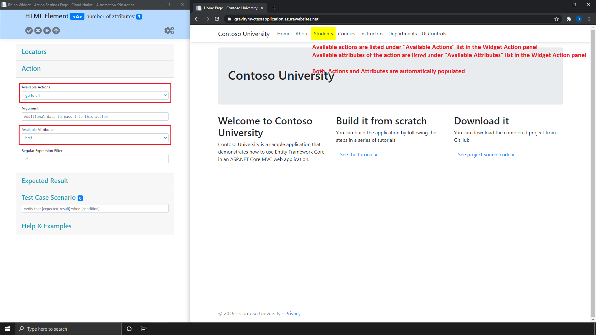

[Home](../Home.md 'Home') 

# Rhino Widget - Overview - Actions Panel
10/19/2020 - 15 minutes to read

## In This Article
* [Action](#action)
* [Argument](#argument)
* [Attribute](#attribute)
* [Regular Expression](#regular-expression)

By using Rhino recorder, you can create a simple or a complex action. Each action can be captured or manually created. Every action is composed of 4 properties (the relevant properties for an action will be different, depends on the actions). A collection of actions is a test case.

  
_image - Actions Panel_

## Action
Action will use a [locator](./WidgetOverviewLocators.md 'WidgetOverviewLocators') in order to locate an element and perform the selected action on it. For example, if I want to perform a click on a link with the ```Link Text``` **Students**, I will select the ```Link Text``` locator and the ```Click``` action.

## Argument
> Argument may be different, based on the action and the action information options available for that action.  

Additional information to pass with the action. For example, if my action is ```go to url``` the argument will be the URL I want to navigate to (like ```https://www.foo.io```).

## Attribute
> Attributes are automatically populated when you capture an element with the recorder.  

The element attribute on which you want to perform your action. For example, if I want to navigate to a URL taken from an element ```href``` attribute, my action will be ```go to url```, my [locator](./WidgetOverviewLocators.md 'WidgetOverviewLocators') will be the element I want to take the ```href``` attribute from and the attribute value will be ```href```.

## Regular Expression
> Regular expression automatically applied, under the hood, on all action results. The default expression is ```.*```.  

An extra filter to apply on text or attribute **before** action is performed. For example, if I want to navigate to a URL taken from an element ```text``` but the text contains more than just URL, my action will be ```go to url```, my [locator](#locators) will be the element I want to take the URL from and the regular expression will be ```(www|http:|https:)+[^\s]+[\w]```.

## See Also
* [Regular Expression Reference](https://docs.microsoft.com/en-us/dotnet/standard/base-types/regular-expression-language-quick-reference)
* [Regular Expression Tutorials](https://regexone.com/)