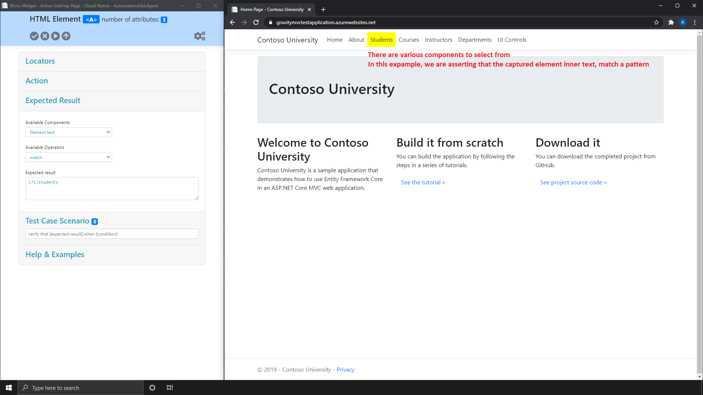
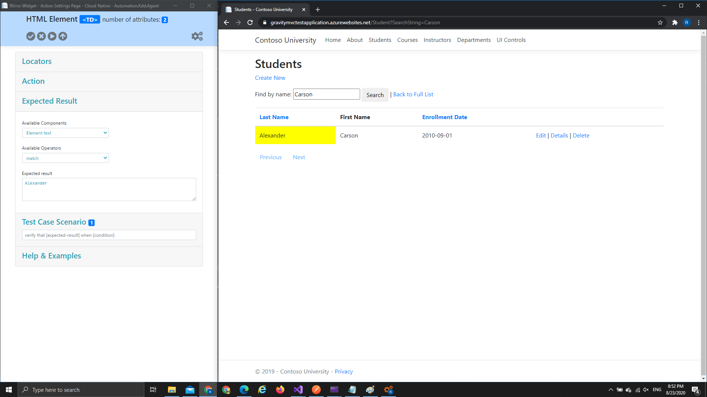
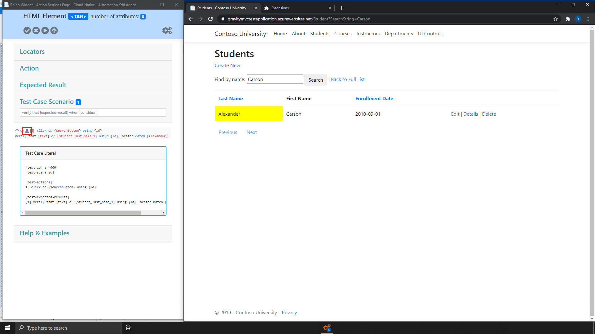

[Home](../Home.md 'Home') 

# Rhino Widget - Overview - Expected Results Panel
10/19/2020 - 15 minutes to read

## In This Article
* [Component](#component)
* [Operator](#operator)
* [Expected Value](#expected-value)

> Expected results follows the same rules as [action](./WidgetOverviewActions.md 'WidgetOverviewActions') does and you can use the action panel to pass [attribute](./WidgetOverviewActions.md#attribute) and [regular expression](./WidgetOverviewActions.md#regular-expression) with the expected result.  

By using Rhino recorder, you can create a simple or a complex expected result. Each result is manually created and every expected result is composed out of 3 properties (the relevant properties for a result will be different, depends on the result type).

  
_image - Expected Results Panel_

## Component
>  The element component on which to perform the assertion is the assertion **actual result**.  

The element component on which to perform an assertion. For example, element text, element attribute, visibility status, etc.

## Operator
> Not all operators are valid on certain situations, for example, using ```greater than``` with text (non numerical) values.  

The operator to use when asserting the element component value (the actual result) against the expected result value. For example, equal, not equal, greater than, match (regular expression), etc.  

## Expected Value
The expected result value to assert against. This value may be different depends on the component selected.  

  
  
The expected result will be applied to the last action in the scenario and can be seen when clicking on the beaker icon.  



## See Also
* [Regular Expression Reference](https://docs.microsoft.com/en-us/dotnet/standard/base-types/regular-expression-language-quick-reference)
* [Regular Expression Tutorials](https://regexone.com/)