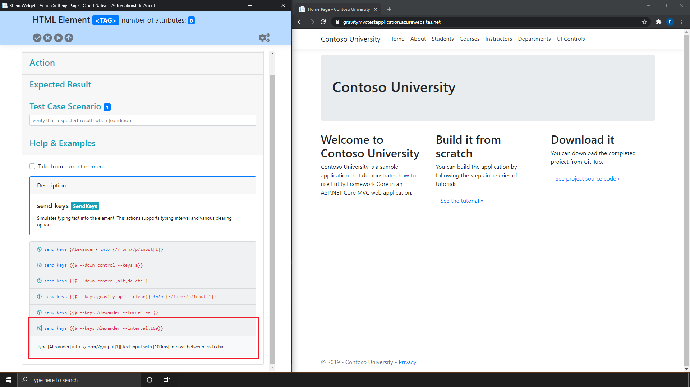

[Home](../Home.md 'Home') 

# Rhino Widget - Overview
10/19/2020 - 15 minutes to read

## In This Article
* [Description](#description)
* [Examples](#examples)
* [From Current Element](#from-current-element)

> In order to trigger help and examples for a specific action, you need to select that action from the [Available Actions](./WidgetOverviewActions.md#action) list.

Rhino Widget generates an interactive help and examples for the various available actions. The **Help and Examples** information will change according to the action and options selected and will reveal all available operations for that action.

## Description
In order to get help and information about a specific action, select it from the list and expand the ```Help & Examples``` panel

  
_image - Actions Panel_  

  
_image - Help and Examples Panel_

## Examples
> To see the description of a certain example, click on the small question mark **(?)** on left side of the example you wish to use.  

Each action have a one or more examples of how to use it and the options available for that action. Each example have tow parts.  

1. Literal Example: Rhino phrase of how to write this example using Rhino Language.
2. Description: A short explanation of what the action does.  

  
_image - Help and Examples Panel_

## From Current Element
By checking this check box, Rhino will generate a literal phrase (Rhino Language Action) of the action you have selected including all properties and the arguments you have used, from the current captured action.

## see also
* [Gravity Actions](https://github.com/gravity-api/gravity-actions)