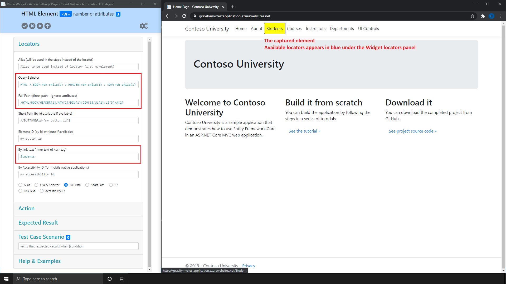

[Home](../Home.md 'Home') 

# Rhino Widget - Overview - Locators Panel
10/19/2020 - 15 minutes to read

## In This Article
* [Query Selector (CSS)](#query-selector)
* [Link Text](#link-text)
* [ID](#id)
* [Short XPath/Full XPath](#xpath)

Rhino recorder is being activated by [connecting to Rhino widget](./ConnectWidget.md 'ConnectWidget'). Once you are connected, Rhino Widget
recorder is being activated as a yellow marker on your native browser. Rhino records the element locators based on availability of the elements properties (e.g. if the element is not a link it will not capture a ```LinkText``` locator).

  
_image - Locators Panel_

## Query Selector
A [DOMString](https://developer.mozilla.org/en-US/docs/Web/API/DOMString) containing one or more selectors to match against. This string must be a valid [CSS selector](https://developer.mozilla.org/en-US/docs/Web/CSS/CSS_Selectors) string.  In the following code example, the locator value of ```<a>Students</a>``` link, will be ```#sdnt```.

```html
<a id="sdnt">Students</a>
<a id="home">Home</a>
```  

## Link Text
A Link Text is used to identify the links element on a web page, by the inner text of ```<a></a>``` tags. In the following code example, the locator value of ```<a>Students</a>``` link, will be ```Students```.

```html
<a>Students</a>
<a>Home</a>
```  

## ID
ID is used to identify the element on a web page, by the value of ```id``` attribute. In the following code example, the locator value of ```<a>Students</a>``` link, will be ```sdnt```.

```html
<a id="sdnt">Students</a>
<a id="home">Home</a>
```  

## XPath
> Both ```Short Path``` and ```Full Path``` are considered as ```XPath``` locator by Rhino, but with a different value. All elements will have ```Full XPath```.  

A [XPath](https://developer.mozilla.org/en-US/docs/Web/XPath) containing one or more selectors to match against. In the following code example, the locator value of ```<a>Students</a>``` link, can be ```//a[@id='sdnt']```.  

```html
<a id="sdnt">Students</a>
<a id="home">Home</a>
```

## See Also
* [CSS Selectors Tutorial](https://www.w3schools.com/css/css_syntax.asp)  
* [CSS Selectors Reference](https://www.w3schools.com/cssref/css_selectors.asp)
* [XPath Tutorial](https://www.w3schools.com/xml/xpath_intro.asp)  
* [XPath Reference](https://www.w3schools.com/xml/xpath_syntax.asp)