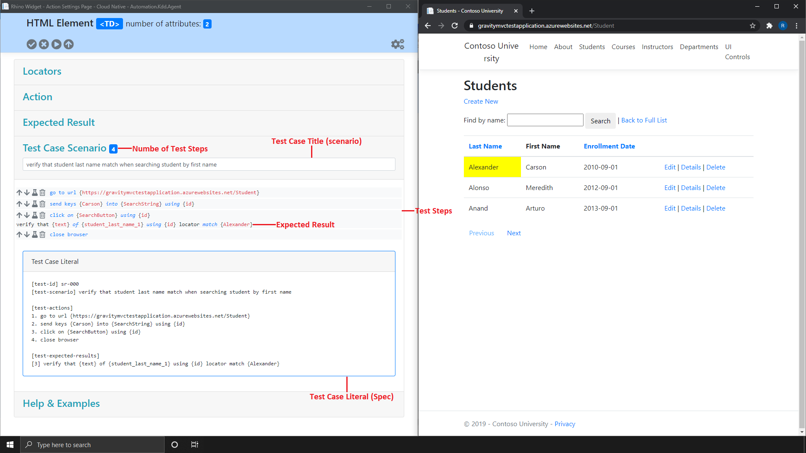
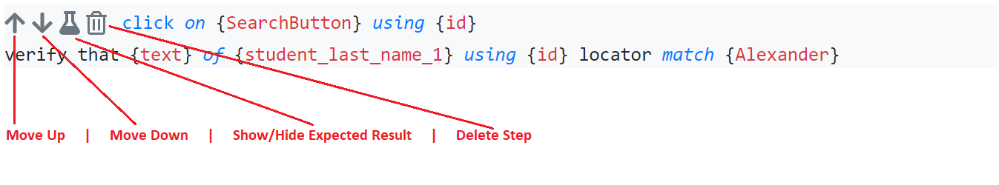

[Home](../Home.md 'Home') 

# Rhino Widget - Overview - Test Case Scenario Panel
10/19/2020 - 15 minutes to read

## In This Article
* [Test Title](#test-title)
* [Test Steps](#test-steps)
* [Expected Result](#expected-result)
* [Test Case Literal](#test-case-literal)

This is the place where you can see the captured steps and their values, copy the generated automation test, give a title and organize your test steps.  

  
_image - Test Case Scenario Panel_

## Test Title
> **Test Title** is a mandatory field and your test will not be sent to an A.L.M if leave empty. You can still save your test and come back to it later.  

A short description of what this test does. It is a good practice to include the feature or component under test, the initial state, the action which will be performed and the expected result. There is no unified standard for test case titles, but there are many best practices and guidelines.  

```
Example #1: Verify that student last name match when searching student by first name
Example #2: Search Students: Search student by first name. Student last name match to the expected last name of each student.
```

## Test Steps
> **Test Steps** are automatically created and populated by Rhino Widget.  

This section holds a list of steps (actions) captured by Rhino Widget. The syntax and layout of each step is based on Rhino language rules and standards for manual tests design.  

Each step have actions buttons which can be used to perform certain operations on the test step as illustrated here:  

  
_image - Test Steps_

## Expected Result
> You can show/hide expected result by clicking on the beaker icon.  

This is the expected result of the test as captured by Rhino Widget. The syntax and layout of each expected result is based on Rhino language rules and standards for manual tests design. 

## Test Case Literal
> **Test Case Literal** can be sent directly to Rhino API or can be executed using the text connector.  

This is the test case raw form and it represents the format by which Rhino automation tests (or specs) are actually written as text. You can copy it from the widget and use it with Rhino API, text connector or any other component which supports Rhino or supported by Rhino.

## See Also
* [Rhino Text Connector](https://github.com/savanna-projects/rhino-connectors-text)
* [Rhino Gurock (TestRail) Connector](https://github.com/savanna-projects/rhino-connectors-gurock)
* [Rhino Atlassian (Jira + XRay) Connector](https://github.com/savanna-projects/rhino-connectors-atlassian)
* [Rhino Azure (TFS/Azure DevOps) Connector](https://github.com/savanna-projects/rhino-connectors-azure)
* [Rhino API Reference - Test Cases](../ApiReference/TestCases.md 'TestCases')