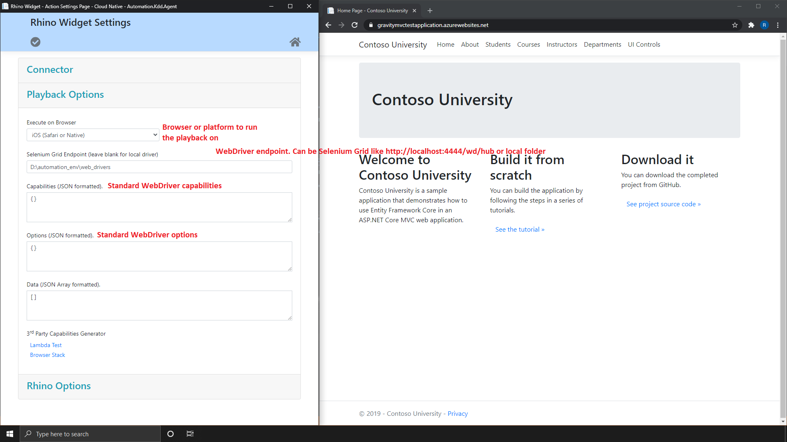

[Home](../Home.md 'Home') 

# Rhino Widget - Overview - Settings
10/19/2020 - 5 minutes to read

## In This Article
1. [Connector](#connector)
2. [Playback Options](#playback_options)
3. [Rhino Options](#rhino_options)  

> Not all possible configurations and options are exposed under settings page and many of them are part of the configuration you will be used when running your automation.

Under settings page you set the integration to your A.L.M (e.g. Jira, Test Rail, Azure DevOps), the playback options to test your automation before publishing it and Rhino options and credentials. You can open the settings page by clicking on the ```Settings``` button.  

  
_image - Settings Button_  

## Connector
|Field         |Description                                                                                                                           |
|--------------|--------------------------------------------------------------------------------------------------------------------------------------|
|Connector Type|Will be used to connect to an Application Lifecycle Manager (A.L.M). For example, Jira, Test Rail or Azure DevOps.                    |
|Server Address|The A.L.M server address as provided by the A.L.M provider. For example, http://myjira:8080/ or https://organization.visualstudio.com/|
|Project       |The project ID or Name under which to generate test cases. For example "My Project" or "PRJ-1".                                       |
|Test Suite    |Test suite or Test set id under which to create this test case. If not provided the test case will be created under the project.      |
|User Name     |A valid user with permissions to create test cases.                                                                                   |
|Password      |A valid password. Please note that on some A.L.M configurations you need to provide API Key or Token.                                 |

## Playback Options
|Field        |Description                                                                                                         |
|-------------|--------------------------------------------------------------------------------------------------------------------|
|Browser      |A list of available browsers. This will be the browser on which to execute the automation playback.                 |
|Grid Endpoint|Grid endpoint or local driver path. This also support 3rd party like Browser Stack & Lambda Testing.                |
|Capabilities |Driver capabilities as commonly used in WebDriver protocol. Custom and 3rd party capabilities are supported as well.|
|Options      |Driver options as commonly used in WebDriver protocol clients such as [Selenium](https://www.selenium.dev/).        |  

  
_image - Playback Options Panel_  

## Rhino Options
> Rhino is using Gravity API in order to execute the automation scenarios, therefore you need a Gravity account in order to execute the automation. Gravity is an open source freemium automation engine with free tier without features limitations.  

|Field    |Description                                                                                                                                                       |
|---------|------------------------------------------------------------------------------------------------------------------------------------------------------------------|
|User Name|A valid Gravity/Rhino user name. If you don't have any, please [register for free Gravity API account](https://g-api.azurewebsites.net/Identity/Account/Register).|
|Password |A valid Gravity/Rhino password.                                                                                                                                   |